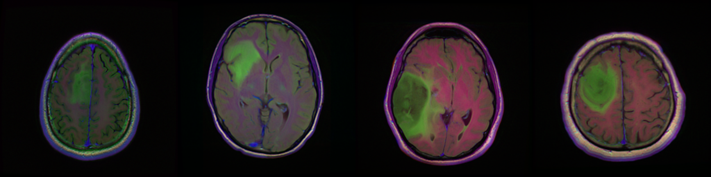
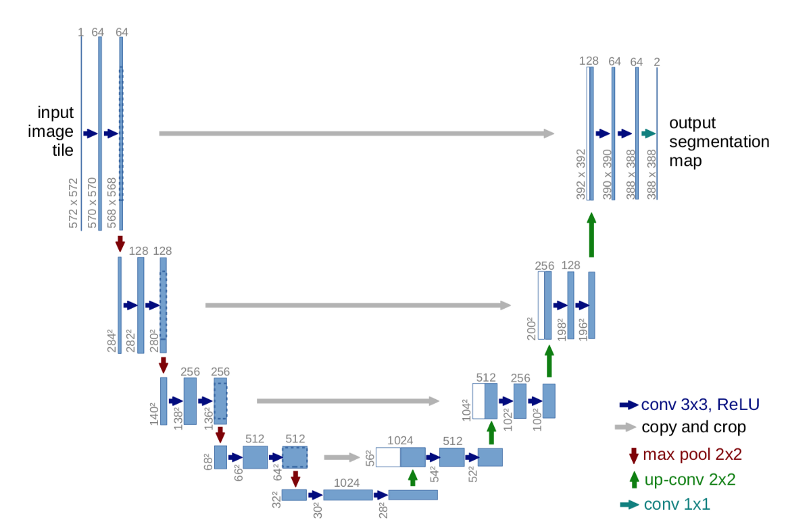
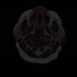

# Brain Tumor MRI - Instance segmentation with UNET 3D

This example shows how to do instance segmentation on Brain MRI to detect tumors with the UNET 3D model using sclices.

## Dataset

The dataset used for development and evaluation was made publicly available on Kaggle: [kaggle.com/mateuszbuda/lgg-mri-segmentation](https://www.kaggle.com/mateuszbuda/lgg-mri-segmentation).
It contains MR images from [TCIA LGG collection](https://wiki.cancerimagingarchive.net/display/Public/TCGA-LGG) with segmentation masks approved by a board-certified radiologist at Duke University.



## Model

We use a UNET model in 2D so we do the segmentation on each slices of the 3D dataset.




## Result



## Training

1. Download the images from Kaggle and save it in Data3D with this structure :
```
Data3D
│   
└───train
│   │
│   └───TCGA_CS_4941_19960909
│   │   │   TCGA_CS_4941_19960909_1_mask.tif
│   │   │   TCGA_CS_4941_19960909_1.tif
│   │   │   ...
│   │
│   └───TCGA_CS_4942_19970222
│   ...
│   
└───test
    │
    └───TCGA_CS_5396_20010302
    │   │
    │   └───Input
    │   │       
    │   └───Target
    │       
    │ 
    └───TCGA_DU_5871_19941206  
    ...
    
```
2. Run `main.py` with arguments `--images_dir` (path to Data file (default: ./Data3D/train/)), `--lr` (learning rate for training (default: 0.001)), `--epochs` (number of epochs for training (default: 30)) and `--save_model` (Do you want to save the model (default: False)). For more informations and help run: `python3 main.py --help`.

## Training with Custom Jobs

Before running the code, you need to verify that you put the suitable parameters in `Makefile` (PROJECT_ID, JOB_NAME, LOCATION ...) and `config.yaml file` (workerPoolSpecs, serviceAccount ...)

To run a custom job in Vertex AI, run the following command :
```bash
make
```

After that you can follow the log information to see how your training goes.

## Inference

1. Download images to predict
2. Run `inference.py` with arguments `--weights` and `--images` for the images directory. For more informations and help run: `python3 inference.py --help`.


## Deployment with Vertex Ai Endpoint

You can deploy your model on Vertex AI Endpoint for inference. You can follow this article that guides you step by step to deploy a Pytorch model on Vertex AI : https://data-servier.atlassian.net/l/cp/A0FYepXV