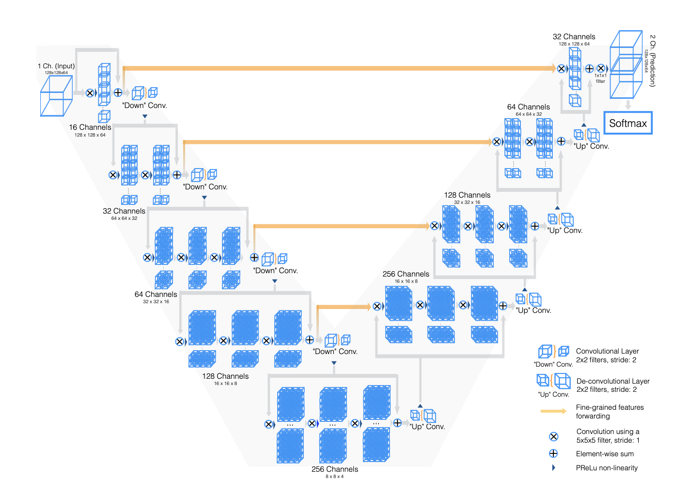
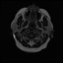

# Brain Tumor MRI - Instance segmentation with VNET

This example shows how to do instance segmentation on Brain MRI to detect tumors with the VNET model.

## Dataset

The dataset used for development and evaluation was made publicly available on Kaggle: [kaggle.com/mateuszbuda/lgg-mri-segmentation](https://www.kaggle.com/mateuszbuda/lgg-mri-segmentation).
It contains MR images from [TCIA LGG collection](https://wiki.cancerimagingarchive.net/display/Public/TCGA-LGG) with segmentation masks approved by a board-certified radiologist at Duke University.


## Model

Vnet is a PyTorch implementation of the paper [V-Net: Fully Convolutional Neural Networks for Volumetric Medical Image Segmentation](https://arxiv.org/abs/1606.04797) by Fausto Milletari, Nassir Navab, and Seyed-Ahmad Ahmadi. 




## Result



## Training

1. Download the images from Kaggle and save it in the folder Data3D with this structure :
Input folder contains the images in 3D and Target the masks in 3D.
```
Data3D
│   
└───train
│   │
│   └───Input
│   │   │   TCGA_CS_4942_19970222.tif
│   │   │   TCGA_CS_4943_20000902.tif
│   │   │   ...
│   │
│   └───Target
│       │   TCGA_CS_4942_19970222.tif
│       │   TCGA_CS_4943_20000902.tif
│       │   ...
│ 
└───val
│   │
│   └───Input
│   │           
│   └───Target
│    
└───test
    │
    └───Input
    │           
    └───Target
    
```
2. Run `main.py` with arguments `--train_images_dir` (path to Data file (default: ./Data3D/train/)), `--val_images_dir` (path to val Data file (default: Data3D/val)), `--test_images_dir` (path to test Data file (default: Data3D/test)), `--output_dir` (path to segmentation output file (default: ./)) and `--save_model` (Do you want to save the model (default: False)). For more informations and help run: `python3 main.py --help`.

If you want a simple tutorial, you can check the notebook [here](./brain_mri_vnet/mri-brain-segmentation-vnet.ipynb). 

## Inference

1. Download images to predict
2. Run `inference.py` with arguments `--weights`, `--output_dir` and `--images` for the images directory. For more informations and help run: `python3 inference.py --help`.


## Deployment with Vertex Ai Endpoint

You can deploy your model on Vertex AI Endpoint for inference. You can follow this article that guides you step by step to deploy a Pytorch model on Vertex AI : https://data-servier.atlassian.net/l/cp/A0FYepXV